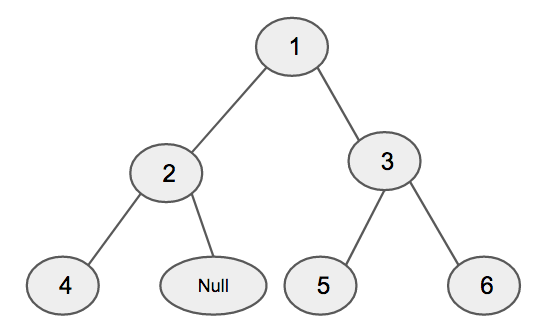

# calculation-x
UI and APIs for a user to calculate longest path in a binary tree


##Tech stack
API
* Spring Boot
* H2 DB
* Maven

UI
* React
* Javascript
* Yarn

Deployment
* Docker
* Kubernetes

## How to run
Install
* Docker desktop (Recommended latest version - 2.1.0.1), It comes with Kubernetes (Open-source Container-Orchestration System) built in - https://docs.docker.com/docker-for-mac/install/
* Kubectl v1.14.3 - https://kubernetes.io/docs/tasks/tools/install-kubectl/

Run the following commands
* `cd ~/`
* `git clone https://github.com/venks06/calculation-x.git`
* `cd ~/calculation-x/kubectl`
* `kubectl apply -f service.yml`
* `kubectl apply -f deployment.yml`
* `kubectl apply -f hpa-nginx.yml`
* `kubectl apply -f hpa-tomcat.yml`
* `kubectl get all`

Open a browser and enter http://localhost:30000/ you will see the UI.

If you would like to delete all the Docker containers, run the following commands from the same directory.
* `kubectl delete -f service.yml`
* `kubectl delete -f deployment.yml`
* `kubectl delete -f hpa-nginx.yml`
* `kubectl delete -f hpa-tomcat.yml`
* `kubectl get all`

## Buid docker containers
* Install latest versions of maven (https://maven.apache.org/install.html) and yarn (https://yarnpkg.com/lang/en/docs/install/#mac-stable)
* `cd ~/`
* `git clone https://github.com/venks06/calculation-x.git`
* `cd ~/calculation-x/calculation-service`
* `mvn clean install` -> Builds the Service docker image
* `docker images` -> Lists all the docker images in your local machine. You should see `vpandeti/calculationservice:1.0.0` in the list.
`docker run -d -p 30001:30001 vpandeti/calculationservice:1.0.0` 
* `cd ~/calculation-x/caculation-ui`
* `yarn build` -> Builds the UI docker image
* `docker images` -> Lists all the docker images in your local machine. You should see `vpandeti/calculation-ui:1.0.0` in the list.

## Test
* `cd ~/`
* `git clone https://github.com/venks06/calculation-x.git`
* `cd ~/calculation-x/calculation-service`
* `mvn clean test`

For UI, we can use jest (https://jestjs.io/docs/en/tutorial-react) to test React components. It's not covered here.

## Longest Path Calculation Input
Child nodes are stored at an index `(2 * index + 1)` and `(2 * index + 2)`. e.g, the following tree is encoded as `[1,2,3,4,null,5,6]`



Input: `1,2,3,4,null,5,6`

Output: `[1 -> 3 -> 6]`

Input: `1,2,3,4,null,5,6,7,8,9,0,1,100,200,300,1`

Output: `[1 -> 2 -> 4 -> 7 -> 1]`

## REST APIs
```
POST /user
Content-Type: application/json
Request Body:
{
    "firstName":"John",
    "lastName":"Wick",
    "username":"jwick",
    "password":"jwick",
    "email":"jwick@jw.com",
    "createdTime":"1565559563000"
}

Response: 
Status: 201
{
   "usrename": "jwick",
   "status": "Created",
   "error": ""
}

----------------------------

POST /user/{username}/login
Content-Type: application/json
Request Body:
{
    "password":"jwick"
}

Response:
Status: 200
{
   "usrename": "jwick",
   "status": "Logged in",
   "error": ""
}

----------------------------

POST /binaryTree/longestPath
Content-Type: application/json
Authorization: Basic andpY2s6andpY2s=
Request Body:
["1","2","3","4","5","6","7","8"]

Response:
Status: 200
{
   "result": [
       1,
       2,
       4,
       8
   ],
   "status": "Successfully calculated",
   "error": ""
}

----------------------------

GET /health/check

Response:
Status: 200
Up
```

## Database
H2 in memory database is used to store the user data. Only user table is being updated by the UI as of now. User Audit (such as login and logout timestamps, etc.) not implemented.

```sql
drop table if exists user;

create table user (
user_id bigint NOT NULL auto_increment primary key,
first_name varchar(20) NOT NULL,
last_name varchar(20) NOT NULL,
username varchar(20) NOT NULL UNIQUE,
password varchar(64) NOT NULL,
email varchar(254) NOT NULL,
created_time bigint NOT NULL
);

drop table if exists user_audit;

create table user_audit (
user_id int  NOT NULL,
active_at int NOT NULL
);
```
